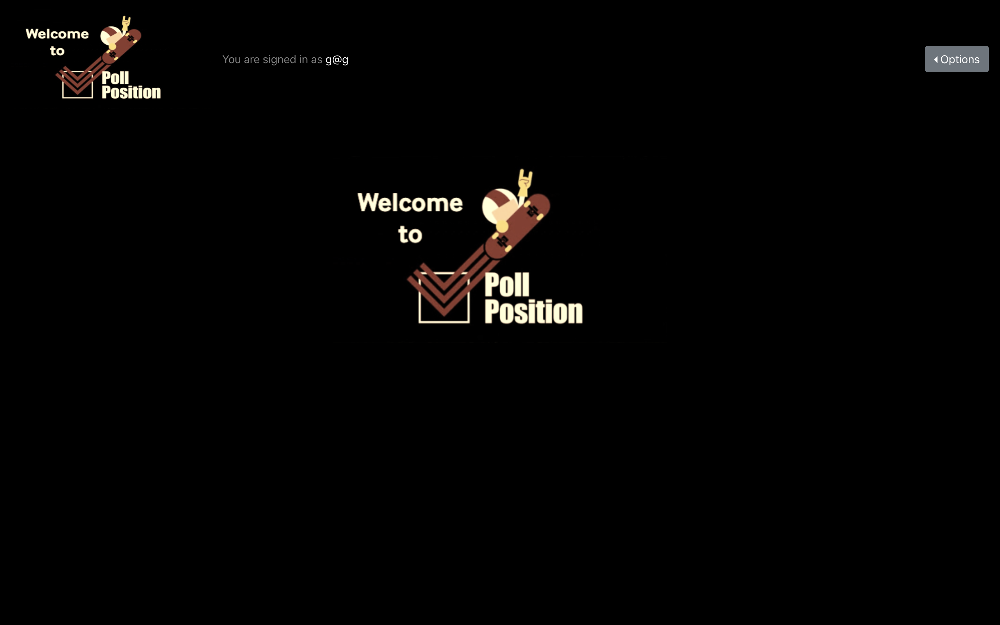
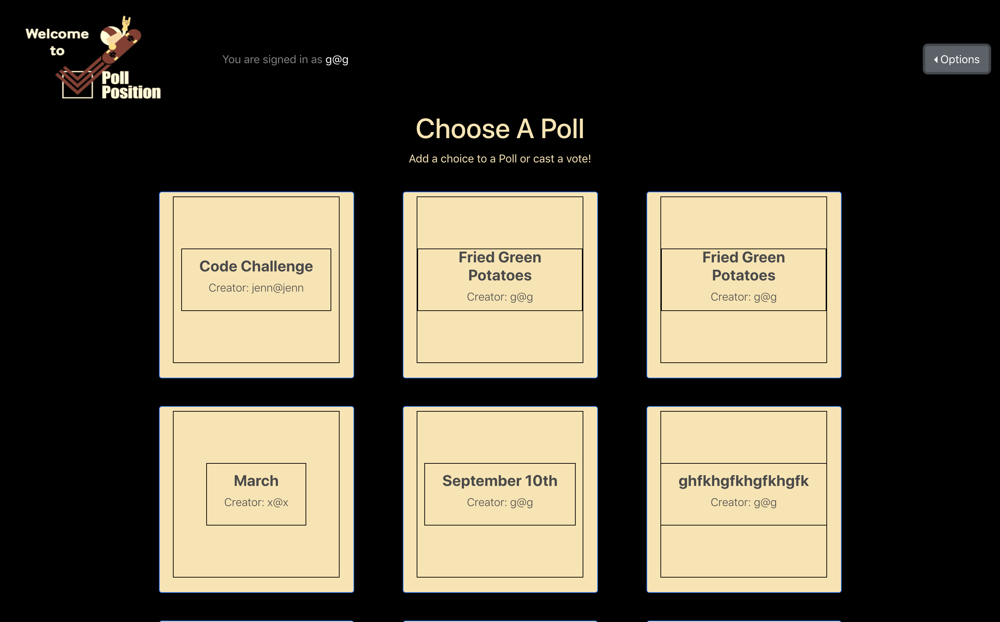

## Work in progress!!
The client side is being built with [React.js](https://reactjs.org).

The Back End is being built with [Ruby on Rails](https://rubyonrails.org).

You can find the API Repo [here](https://github.com/GMorse19/vote).

# Poll Position
### Home page

A polling/voting app centered around creating an event with multiple
choices that users can add to and then vote on.

I began this project, mostly, to practice manipulating and working with multiple relational resources in an API. I also wanted to create something that my fellow aspiring code enthusiasts could use to stay in touch with each other.

### Poll list

I figured what better way to do this than to build an app for scheduling coding practices or hackathons.

Poll Position(working title) is designed to display a user created event that multiple people can add choices to, anonymously vote on and then tally the votes and see what selection will be chosen for the event date.

### Choice list

## Installation
1. Install dependencies with `npm install`.
1. `git add` and `git commit` your changes.
1. Run the development server with `npm start`.

## Deployment

Before deploying, you first need to make sure the `homepage` key in your
`package.json` is pointing to the correct value. It should be the url of your
deployed application.

To deploy you should first make sure you are on the `master` branch with a
clean working directory, then you can run `npm run deploy` and wait to see if
it runs successfully.

## [License](LICENSE)

1. All content is licensed under a CC­BY­NC­SA 4.0 license.
1. All software code is licensed under GNU GPLv3. For commercial use or
    alternative licensing, please contact legal@ga.co.
